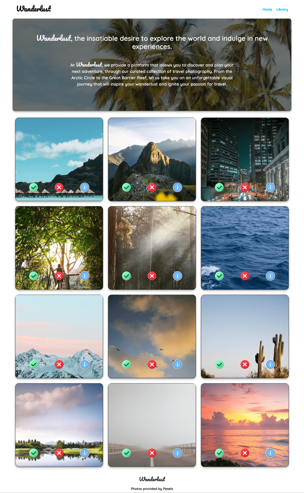
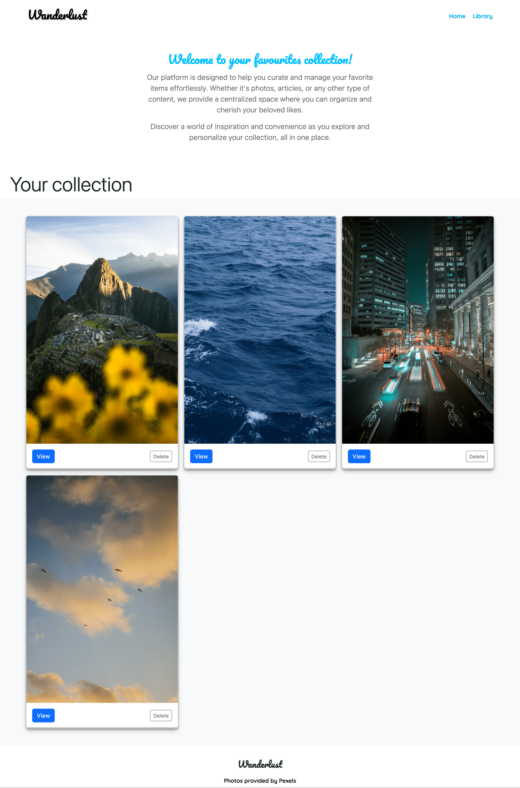

# Wanderlust - Photo Liking App

## What is Wanderlust?
Wanderlust is a strong desire or impulse to travel and explore the world. It embodies the excitement and curiosity to discover new places, cultures, and experiences. The Wanderlust app aims to bring this sense of adventure and exploration into the digital realm by allowing users to browse and like captivating photos from various destinations.

## Project Description

Wanderlust is a photo liking application developed in vanilla JavaScript. Inspired by platforms like Pinterest, it provides users with a visual journey through a collection of stunning photographs. Users can browse through a diverse range of images, like their favorite photos, and store them as personal favorites.

### The project consists of two main components

#### cards.js

The `cards.js` script handles the API setup, queries, and storage arrays. It utilizes the Pexels API to fetch a curated list of high-quality photos related to nature, landscapes, beaches, mountains, cities, and more. These photos are displayed as interactive cards, allowing users to like or dislike each image. Additionally, detailed information about a photo can be viewed in a modal dialog.

Features of `cards.js`:

- Integration with the Pexels API to retrieve captivating photos.
- Generation and display of interactive photo cards.
- Like and dislike functionality for each photo.
- Display of detailed information about each photo in a modal dialog.

#### library.js

The `library.js` script manages the user's favorite photos. It retrieves the liked photos from session storage and generates corresponding cards, presenting them in the "Favorites" section. Users can easily remove a photo from their favorites if desired.

Features of `library.js`:

- Retrieval of liked photos from session storage.
- Generation and display of cards for each liked photo in the "Favorites" section.
- Ability to remove photos from the favorites list.

### Usage

To explore and utilize the Wanderlust app, follow these steps:

1. Open the application in a web browser.

2. The `cards.js` script will fetch a collection of photos and display them.

3. Click the "Like" button on a card to add the photo to your favorites.

4. Click the "Dislike" button on a card to remove the photo from your favorites.

5. Navigate to the "Favorites" section to view all your liked photos.

6. Click the "Delete" button on a favorite photo to remove it from your favorites.

### Installation

To set up the Wanderlust app locally, follow these steps:

1. Clone the repository to your local machine using the following command: git clone https://github.com/brianlangley/Wanderlust.git

2. Open the `index.html` file in a web browser.

3. Ensure you have obtained an API key from Pexels. If you don't have one, visit the [Pexels API](https://www.pexels.com/api/) website to sign up and obtain an API key.

4. In the `config.js` file, replace `'YOUR_API_KEY'` with your actual API key:

```javascript
// Fill in your API key below (link to Pexels API: https://www.pexels.com/api/)
window.apiKey = 'YOUR_API_KEY';
```
5. Save the `config.js` file.

6. Refresh the `index.html` page in your web browser.

7. The Wanderlust app is now ready to use!

### Screenshots

Here are a few screenshots of the Wanderlust app:

Homepage:


Library:


### Dependencies

The Wanderlust app is built using vanilla JavaScript, HTML, and CSS and does not rely on any external libraries or frameworks.

### Compatibility

The application is compatible with modern web browsers that support JavaScript.

### Credits

The Wanderlust app utilizes the Pexels API to fetch the photos. Visit Pexels for more information.

### License

The Wanderlust app is released under the MIT License. You are free to use, modify, and distribute the app in accordance with the terms of the license.
